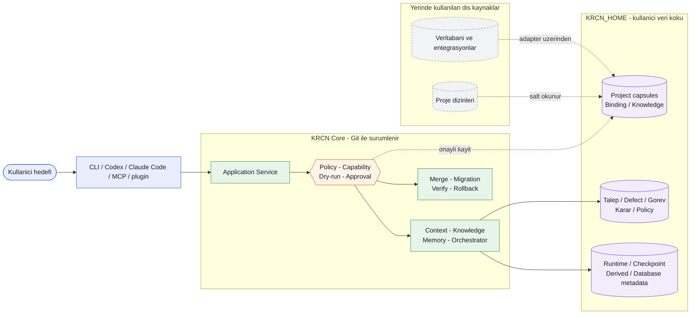

# KRCN Core

**KRCN Core**, projeleri, belgeleri, iş taleplerini, kararları, kalıcı bağlamı ve belleği ortak bir çekirdek üzerinden birbirine bağlayan, yerel öncelikli (local-first) bir platformdur. Kullanıcı hedefini doğal dille anlatır; sistem bu hedefi somut bir göreve, kaynak ilişkisine ve doğrulanabilir bir plana dönüştürür - kullanıcı verisine asla sessizce dokunmadan.

KRCN Core'un temel yaklaşımı ve özgün mimarisi **Mehmet KARACAN** tarafından tasarlanmıştır. Bu repository, o mimari vizyonu sürdürülebilir ve açık bir teknik yapıya dönüştürmek için yürütülür.

## Neden KRCN Core

Çoğu araç ya ürünü kullanıcı verisiyle aynı yere gömer (güncelleme veri kaybı riski taşır) ya da kullanıcı verisini bir buluta taşır (yerel öncelik ve gizlilik kaybolur). KRCN Core bu ikisini birbirinden ayırır:

- **Çekirdek** (kod, şema, politika, migration) Git ile sürümlenir ve kontrollü şekilde güncellenir.
- **Kullanıcı verisi** (projeler, belgeler, talepler, kararlar, bellek) kullanıcının kendi makinesinde, `KRCN_HOME` altında kalır ve hiçbir güncelleme onu sessizce değiştiremez.
- **Dış kaynaklar** (proje dizinleri, veritabanları) yerinde okunur; KRCN içine kopyalanmaz.

Bu ayrım sayesinde çekirdek her güncellendiğinde kullanıcının projeleri, ayarları ve geçmişi bozulmadan kalır.

## Mimari genel görünüm

İstek bir istemciden girer, tek bir ortak servisten geçer, policy ve onay kapısından süzülür; sonuç yalnızca kendi sahiplik sınıfına ait alana yazılır.



| Katman | Sorumluluk |
| --- | --- |
| **İstemci** | CLI, Codex, Claude Code, MCP sunucusu veya bir plugin. Doğal dili tipli bir isteğe çevirir; ürün kuralı tanımlamaz. |
| **Application Service** | Tüm istemcilerin çağırdığı tek, transport-bağımsız servis katmanı. |
| **Policy / Capability / Approval kapısı** | Her yan etkiyi dry-run ve exact-plan olarak görünür kılar, gerekiyorsa kullanıcı onayı ister; hiçbir istemci bu kapıyı atlayamaz. |
| **Context / Knowledge / Memory / Orchestrator** | Bilgiyi getirir, görev planlar, işi bir worker'a yürütür, sonucu bağımsız bir verifier ile doğrular. |
| **Merge / Migration / Verify / Rollback** | Core güncellemelerini kullanıcı verisine dokunmadan uygular; başarısız doğrulamada geri alır. |

### Veri sahipliği haritası

| Alan | Konum | Temel kural |
| --- | --- | --- |
| Ürün çekirdeği | Git repository | Kod, şema, migration, policy tanımı ve teknik belgeler sürümlenir. |
| Kullanıcı verisi | `KRCN_HOME/projects/<project-id>` | Proje bağlamı, belgeler, talepler, defect kayıtları, görevler, kararlar, bellek ve kullanıcı policy'leri proje kapsülünde korunur. |
| Runtime ve derived state | `KRCN_HOME` | İş durumu korunur; türetilmiş içerik gerektiğinde yeniden üretilebilir. |
| Dış proje ve kaynaklar | Kendi fiziksel dizinleri | Yerinde okunur, KRCN içine kopyalanmaz, varsayılan olarak değiştirilmez. |
| Secret değerleri | Yerel veya harici secret store | Git'e, loglara veya backup içine yazılmaz. |

### Bir isteğin çalışma akışı

1. İstemci, doğal dil hedefini ortak bağlamla birlikte application service katmanına iletir.
2. Sistem ilgili proje, kaynak, policy, capability ve mevcut çalışma durumunu çözümler.
3. Yan etkiler `dry-run` ve exact plan olarak görünür hale getirilir.
4. Gereken kullanıcı onayından sonra işlem ortak servis üzerinden uygulanır.
5. Sonuç kanıtlarla doğrulanır; kullanıcı verisi ve dış kaynak sınırları korunur.

Core güncellemeleri de aynı disiplinle ilerler: incele, `dry-run` göster, yedekle, uygula, gerekiyorsa migration çalıştır, doğrula; doğrulama başarısız olursa otomatik rollback devreye girer. Tam sözleşme için `docs/specifications/UPDATE-MERGE-CONTRACT.md`.

## Geliştirme durumu

Faz 0 - Faz 11 tamamlandı. Proje kapsülü ve KRCN home yerleşim v2 hazırdır. Proje kaynaklarını kopyalamayan, ham kodu SQLite içinde saklamayan ve sonuçları gerçek dosyadan doğrulayarak okuyan artımlı kaynak kod RAG indeksi yeni kapsül yerleşiminde çalışır. Yerel referans kaynaklarındaki kullanıcı verileri repository içine alınmamıştır. Faz detayları için `docs/plans/ROADMAP.md`.

İlk proje entegrasyonu, yerel çalışma alanı, doctor ve hibrit bilgi araması için `docs/guides/HIZLI-BASLANGIC.md` belgesini kullanabilirsin.

## Başlarken

Windows'ta `krcn` komutunu PowerShell, CMD, Git Bash ve yapay zekâ istemcilerinden kullanabilmek için repository içinde bir kez şu kurulumu çalıştır:

```powershell
py tools\install_cli.py --plan-only
py tools\install_cli.py
```

Kurulum, onaylı core clone'unu `KRCN_CORE_HOME` ile tanımlar ve `KRCN_HOME` kullanıcı veri konumunu değiştirmez. Core güncellemesinden sonra kurulum aracını yeniden çalıştır. Ayrıntılı sözleşme için `docs/specifications/CLI-INSTALLATION.md` belgesine bak.

```bash
python tools/krcn.py doctor
```

Bu komut kurulum gerektirmeden sağlık kontrolünü çalıştırır ve ortamın hazır olup olmadığını gösterir. Tüm komutlar, proje öğrenme, bilgi/bağlam/bellek servisleri, orchestrator ve release/rollback akışları dahil, `docs/specifications/CLI-REFERENCE.md` dosyasında toplanmıştır.

## Daha fazla bilgi

- Çalışma kuralları: `AGENTS.md`
- Araçtan bağımsız başlangıç bağlamı: `AI-CONTEXT.md`
- Komut referansı: `docs/specifications/CLI-REFERENCE.md`
- Yol haritası: `docs/plans/ROADMAP.md`
- Güncelleme sözleşmesi: `docs/specifications/UPDATE-MERGE-CONTRACT.md`
- Proje kapsülü sözleşmesi: `docs/specifications/PROJECT-CAPSULE-LAYOUT.md`

Codex doğrudan `AGENTS.md` kullanır; Claude Code için `CLAUDE.md` aynı ortak kaynakları içe aktarır; diğer istemciler ve plugin'ler `.ai/repository-context.json` manifestini okuyabilir.

## Kurucu ve mimari sahibi

**Mehmet KARACAN** - KRCN Core kurucusu ve özgün mimarinin sahibi
